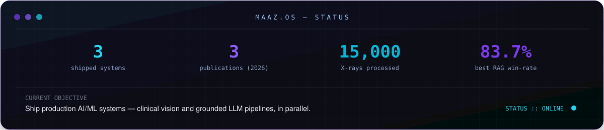
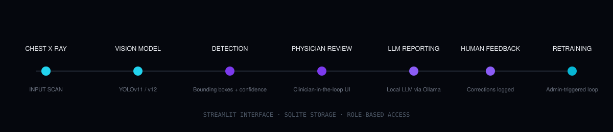

 

 

<!--
  ============================================================
  01 — MAAZ.OS · SYSTEM STATUS
  ============================================================
-->

 

<!--
  ============================================================
  02 — AI CAPABILITY MATRIX
  ============================================================
-->

<h3 align="center">AI CAPABILITY MATRIX</h3>

 

<!--
  ============================================================
  03 — FLAGSHIP PROJECT
  ============================================================
-->

<h3 align="center">FLAGSHIP PROJECT — CHEST X-RAY DISEASE DETECTION SYSTEM</h3>

An end-to-end computer vision system for detecting thoracic abnormalities in chest X-rays — 
built as a full pipeline, not a notebook: <b>detection → clinician review → LLM-assisted reporting → retraining</b>.

<table align="center">
<tr>
<td width="50%" valign="top">

**What it does**
- Object detection on chest radiographs using **YOLOv11 / YOLOv12**, with **Faster R-CNN** used as a comparative baseline
- Class-imbalance handling on the training set using **CTGAN**-based synthetic augmentation
- A **Streamlit** interface with role-based access (radiologist / admin views)

</td>
<td width="50%" valign="top">

**What makes it a system, not a script**
- A locally hosted LLM (via **Ollama**) drafts structured, radiology-style report text from detected findings
- Clinician corrections are logged and feed an **admin-triggered retraining pipeline**
- Data persistence via **SQLite**, with the pipeline versioned across dedicated training and app modules

</td>
</tr>
</table>

[**→ VIEW SYSTEM**](https://github.com/MaazMahboob/AI-Chest-Xray-Disease-Detection-System)

 

<!--
  ============================================================
  04 — RESEARCH CORE
  ============================================================
-->

<h3 align="center">RESEARCH CORE</h3>

| Research line | Contribution | Venue |
|---|---|---|
| Medical computer vision | First-authored chapter on multi-disease chest X-ray detection | IGI Global (book chapter) |
| LLM / RAG systems | Co-authored, LangGraph-based retrieval-augmented generation | arXiv preprint |
| Biomedical NLP | Co-authored, PubMedBERT-based work | Journal of Supercomputing (Springer) |

 

<!--
  ============================================================
  05 — EXPERIENCE
  ============================================================
-->

<h3 align="center">EXPERIENCE</h3>

 

<!--
  ============================================================
  06 — TECH STACK
  ============================================================
-->

<h3 align="center">TECH STACK</h3>

 

<!--
  ============================================================
  07 — GITHUB ACTIVITY
  ============================================================
-->

<h3 align="center">GITHUB ACTIVITY</h3>

  

<picture>
  <source media="(prefers-color-scheme: dark)" srcset="https://raw.githubusercontent.com/MaazMahboob/MaazMahboob/output/snake-dark.svg" />
  <source media="(prefers-color-scheme: light)" srcset="https://raw.githubusercontent.com/MaazMahboob/MaazMahboob/output/snake-light.svg" />
  
</picture>

Generated automatically by <code>.github/workflows/snake.yml</code> — appears after the first workflow run.

 

<!--
  ============================================================
  08 — CONNECT
  ============================================================
-->

<h3 align="center">CONNECT</h3>

Aligarh, India · Open to AI/ML Engineer and Computer Vision Engineer roles

