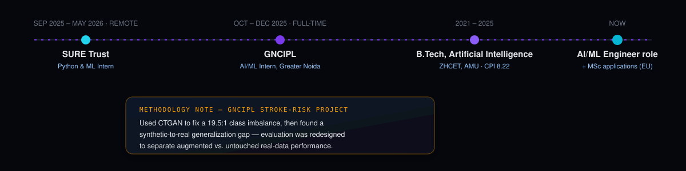
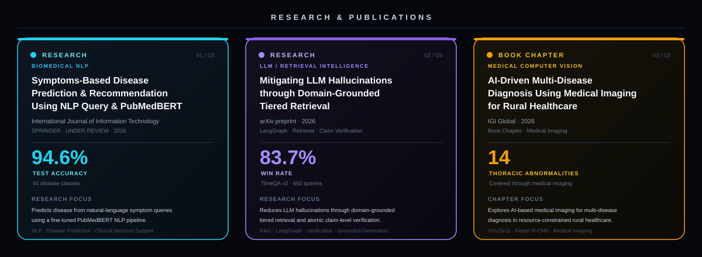

 

 

<!-- ============================================================
     SELECTED SYSTEMS
     ============================================================ -->

[**→ Chest X-ray AI System**](https://github.com/MaazMahboob/AI-Chest-Xray-Disease-Detection-System)

&nbsp;·&nbsp;

[**→ RAG Research Paper**]([https://arxiv.org/](https://arxiv.org/abs/2603.17872))

 

<!-- ============================================================
     ENGINEERING CAPABILITIES
     ============================================================ -->

 

<!-- ============================================================
     EDUCATION & EXPERIENCE
     ============================================================ -->

<h3 align="center">EDUCATION &amp; EXPERIENCE</h3>

 

<!-- ============================================================
     RESEARCH & PUBLICATIONS
     ============================================================ -->

 

<!-- ============================================================
     MORE WORK & ACHIEVEMENTS
     ============================================================ -->

<h3 align="center">MORE WORK &amp; ACHIEVEMENTS</h3>

<table width="100%">
<tr>

<td width="33%" valign="top">

### Computer Vision

**Sign Language Recognition**

LSTM/GRU sequence models with MediaPipe Holistic for **50 ASL gestures**.

**99% / 98% accuracy**

</td>

<td width="33%" valign="top">

### Machine Learning

**Stroke-Risk Prediction**

CTGAN-based class-imbalance work with XGBoost.

**Loan Approval**  
Deep ANN · **92.3% accuracy**

**Customer Churn**  
Random Forest · **86.4% accuracy**

</td>

<td width="33%" valign="top">

### Academic Project

**Used Car Price Prediction**

Regression-based machine learning project for used-car price estimation.

</td>

</tr>
</table>

 

| CERTIFICATIONS | ACHIEVEMENT |
|:---:|:---:|
| Machine Learning Specialization — Stanford / Coursera | **GATE 2025** |
| Neural Networks and Deep Learning — DeepLearning.AI | **AIR 6991** |
| | Data Science & Artificial Intelligence |

 

<!-- ============================================================
     TOOLS
     ============================================================ -->

<h3 align="center">TOOLS I WORK WITH</h3>

 

<!-- ============================================================
     GITHUB CONTRIBUTIONS
     ============================================================ -->

<h3 align="center">GITHUB CONTRIBUTIONS</h3>

<picture>

  <source
    media="(prefers-color-scheme: dark)"
    srcset="https://raw.githubusercontent.com/MaazMahboob/MaazMahboob/output/snake-dark.svg" />

  <source
    media="(prefers-color-scheme: light)"
    srcset="https://raw.githubusercontent.com/MaazMahboob/MaazMahboob/output/snake-light.svg" />

  

</picture>

 

<!-- ============================================================
     CONNECT
     ============================================================ -->

<h3 align="center">CONNECT</h3>

Aligarh, India · Open to AI/ML Engineer and Computer Vision Engineer roles

